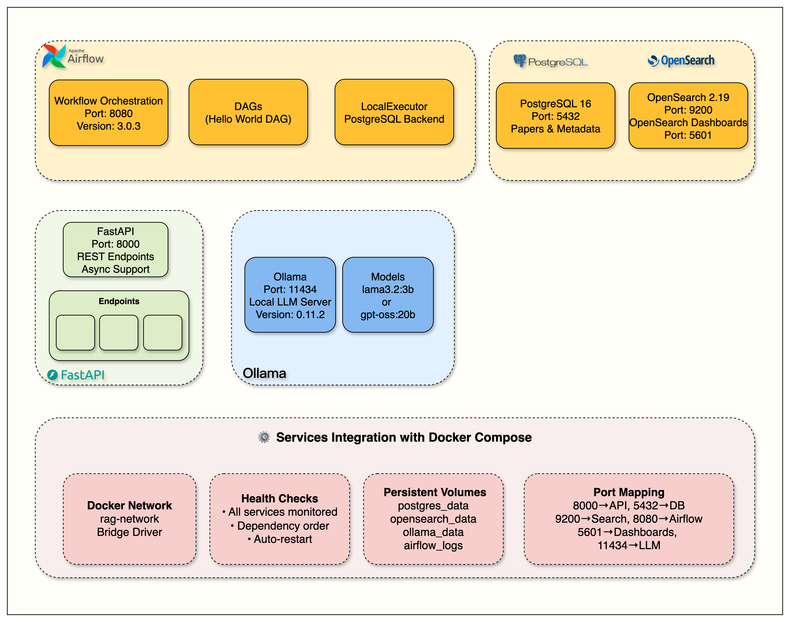
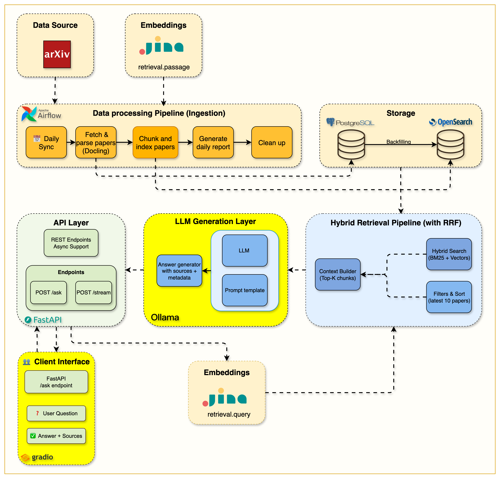

# ArXiv Paper Curator: Production-Grade Agentic RAG Research Assistant

## Overview

ArXiv Paper Curator is an end-to-end Agentic RAG platform designed for academic research. The system automatically ingests papers from arXiv, extracts and indexes document content, performs hybrid retrieval, and generates grounded answers using local LLMs.

Key capabilities include:

- Automated paper ingestion
- BM25 retrieval
- Hybrid search
- LangGraph agents
- Query rewriting
- Document grading
- Redis caching
- Langfuse monitoring
- Telegram bot integration

<p align="center">
  
  
  
  
</p>

</br>

<p align="center">
  <a href="#-about-this-course">
    
  </a>
</p>


## 🏗️ System Architecture Evolution

<div align="center">
  
  <p><em>Complete architecture showing Telegram bot integration with the agentic RAG system</em></p>
</div>

### LangGraph Agentic RAG Workflow
<div align="center">
  
  <p><em>Detailed LangGraph workflow showing decision nodes, document grading, and adaptive retrieval</em></p>
</div>

## 🚀 Quick Start

### **📋 Prerequisites**
- **Docker Desktop** (with Docker Compose)  
- **Python 3.12+**
- **UV Package Manager** ([Install Guide](https://docs.astral.sh/uv/getting-started/installation/))
- **8GB+ RAM** and **20GB+ free disk space**

### **⚡ Get Started**

```bash
# 1. Clone and setup
git clone <repository-url>
cd arxiv-paper-curator

# 2. Configure environment (IMPORTANT!)
cp .env.example .env
# The .env file contains all necessary configuration for OpenSearch, 
# arXiv API, and service connections. Defaults work out of the box.
# You need to add Jina embeddings free api key and langfuse keys (check the blogs)

# 3. Install dependencies
uv sync

# 4. Start all services
docker compose up --build -d

# 5. Verify everything works
curl http://localhost:8000/api/v1/health
```


### **📊 Access Your Services**

| Service | URL | Purpose |
|---------|-----|---------|
| **API Documentation** | http://localhost:8000/docs | Interactive API testing |
| **Gradio RAG Interface** | http://localhost:7861 | User-friendly chat interface |
| **Langfuse Dashboard** | http://localhost:3000 | RAG pipeline monitoring & tracing |
| **Airflow Dashboard** | http://localhost:8080 | Workflow management |
| **OpenSearch Dashboards** | http://localhost:5601 | Hybrid search engine UI |

#### **NOTE**: Check airflow/simple_auth_manager_passwords.json.generated for Airflow username and password
---

## **🏗️ Architecture Overview**

<p align="center">
  
</p>

**Infrastructure Components:**
- **FastAPI**: REST endpoints with async support (Port 8000)  
- **PostgreSQL 16**: Paper metadata storage (Port 5432)
- **OpenSearch 2.19**: Search engine with dashboards (Ports 9200, 5601)
- **Apache Airflow 3.0**: Workflow orchestration (Port 8080)
- **Ollama**: Local LLM server (Port 11434)

## Data Ingestion Pipeline ✅

### **🎯 Objectives**
- arXiv API integration with rate limiting and retry logic
- Scientific PDF parsing using Docling
- Automated data ingestion pipelines with Apache Airflow
- Metadata extraction and storage workflows
- Complete paper processing from API to database

### **🏗️ Architecture Overview**

<p align="center">
  
</p>

**Data Pipeline Components:**
- **MetadataFetcher**: 🎯 Main orchestrator coordinating the entire pipeline
- **ArxivClient**: Rate-limited paper fetching with retry logic
- **PDFParserService**: Docling-powered scientific document processing  
- **Airflow DAGs**: Automated daily paper ingestion workflows
- **PostgreSQL Storage**: Structured paper metadata and content
---

## 📚 Keyword Search First - The Critical Foundation

### **🎯 Objectives**
- Why keyword search is essential for RAG systems (foundation first approach)
- OpenSearch index management, mappings, and search optimization
- BM25 algorithm and the math behind effective keyword search
- Query DSL for building complex search queries with filters and boosting
- Search analytics for measuring relevance and performance
- Production patterns used by real companies

### **🏗️ Architecture Overview**

<p align="center">
  
</p>

**Search Infrastructure Components:**
- **OpenSearch Service**: `src/services/opensearch/` - Professional search service implementation
- **Search API**: `src/routers/search.py` - Search API endpoints with BM25 scoring
- **Quality Metrics**: Precision, recall, and relevance scoring

---

## 📚 Chunking & Hybrid Search - The Semantic Layer

### **🎯 Objectives**

- Section-based chunking with intelligent document segmentation
- Production embeddings with Jina AI integration and fallback strategies
- Hybrid search mastery using RRF fusion for keyword + semantic retrieval
- Unified API design with single endpoint supporting multiple search modes
- Performance analysis and trade-offs between search approaches

### **🏗️ Architecture Overview**

<p align="center">
  
</p>

**Hybrid Search Infrastructure Components:**
- **Text Chunker**: `src/services/indexing/text_chunker.py` - Section-aware chunking with overlap strategies
- **Embeddings Service**: `src/services/embeddings/` - Production embedding pipeline with Jina AI
- **Hybrid Search API**: `src/routers/hybrid_search.py` - Unified search API supporting all modes
---

## 📚 Complete RAG Pipeline with LLM Integration

**Building on Week 4 hybrid search:** Add the LLM layer that turns search into intelligent conversation.

### **🎯 Objectives**
- Local LLM integration with Ollama for complete data privacy
- Performance optimization with 80% prompt reduction (6x speed improvement)
- Streaming implementation using Server-Sent Events for real-time responses
- Dual API design with standard and streaming endpoints
- Interactive Gradio interface with advanced parameter controls

### **🏗️ Architecture Overview**

<p align="center">
  
</p>

**Complete RAG Infrastructure Components:**
- **RAG Endpoints**: `src/routers/ask.py` - Dual endpoints (`/api/v1/ask` + `/api/v1/stream`)
- **Ollama Service**: `src/services/ollama/` - LLM client with optimized prompts
- **System Prompt**: `src/services/ollama/prompts/rag_system.txt` - Optimized for academic papers
- **Gradio Interface**: `src/gradio_app.py` - Interactive web UI with streaming support
- **Launcher Script**: `gradio_launcher.py` - Easy-launch script (runs on port 7861)

---

## 📚 Production Monitoring and Caching

### **🎯 Objectives**
- Langfuse integration for end-to-end RAG pipeline tracing
- Redis caching strategy with intelligent cache keys and TTL management
- Performance monitoring with real-time dashboards for latency and costs
- Production patterns for observability and optimization
- Cost analysis and LLM usage optimization (150-400x speedup with caching)

### **🏗️ Architecture Overview**

<p align="center">
  
</p>

**Production Infrastructure Components:**
- **Langfuse Service**: `src/services/langfuse/` - Complete tracing integration with RAG-specific metrics
- **Cache Service**: `src/services/cache/` - Redis client with exact-match caching and graceful fallback
- **Updated Endpoints**: `src/routers/ask.py` - Integrated tracing and caching middleware
- **Docker Config**: `docker-compose.yml` - Added Redis service and Langfuse local instance

---

## 📚 Agentic RAG with LangGraph and Telegram Bot

### **🎯 Objectives**
- LangGraph workflows for state-based agent orchestration with decision nodes
- Guardrail implementation for query validation and domain boundary detection
- Document grading with semantic relevance evaluation
- Query rewriting for automatic query refinement and better retrieval
- Adaptive retrieval with multi-attempt retrieval and intelligent fallback
- Telegram bot integration with async operations and error handling
- Reasoning transparency by exposing agent decision-making process

### **🏗️ Architecture Overview**

<p align="center">
  
</p>

**Agentic RAG Infrastructure Components:**
- **Agent Nodes**: `src/services/agents/nodes/` - Guardrail, retrieve, grade, rewrite, and generate nodes
- **Workflow Orchestration**: `src/services/agents/agentic_rag.py` - LangGraph workflow coordination
- **Telegram Bot**: `src/services/telegram/` - Command handlers and message processing
- **Agentic Endpoint**: `src/routers/agentic_ask.py` - Agentic RAG API endpoint
---

## ⚙️ Configuration

**Setup:**
```bash
cp .env.example .env
# Edit .env for your environment
```

**Key Variables:**
- `JINA_API_KEY` - Required for Week 4+ (hybrid search with embeddings)
- `TELEGRAM__BOT_TOKEN` - Required for Week 7 (Telegram bot integration)
- `LANGFUSE__PUBLIC_KEY` & `LANGFUSE__SECRET_KEY` - Optional for Week 6 (monitoring)

**Complete Configuration:** See [.env.example](.env.example) for all available options and detailed documentation.

---

## 🔧 Reference & Development Guide

### **🛠️ Technology Stack**

| Service | Purpose | Status |
|---------|---------|--------|
| **FastAPI** | REST API with automatic docs | ✅ Ready |
| **PostgreSQL 16** | Paper metadata and content storage | ✅ Ready |
| **OpenSearch 2.19** | Hybrid search engine (BM25 + Vector) | ✅ Ready |
| **Apache Airflow 3.0** | Workflow automation | ✅ Ready |
| **Jina AI** | Embedding generation (Week 4) | ✅ Ready |
| **Ollama** | Local LLM serving (Week 5) | ✅ Ready |
| **Redis** | High-performance caching (Week 6) | ✅ Ready |
| **Langfuse** | RAG pipeline observability (Week 6) | ✅ Ready |

**Development Tools:** UV, Ruff, MyPy, Pytest, Docker Compose

### **🏗️ Project Structure**

```
arxiv-paper-curator/
├── src/                    # Main application code
│   ├── routers/            # API endpoints (search, ask, papers)
│   ├── services/           # Business logic (opensearch, ollama, agents, cache)
│   ├── models/             # Database models (SQLAlchemy)
│   ├── schemas/            # Pydantic validation schemas
│   └── config.py           # Environment configuration
├── notebooks/              # Weekly learning materials (week1-7)
├── airflow/                # Workflow orchestration (DAGs)
├── tests/                  # Test suite
└── compose.yml             # Docker service orchestration
```

### **📡 API Endpoints Reference**

| Endpoint | Method | Description | Week |
|----------|--------|-------------|------|
| `/health` | GET | Service health check | Week 1 |
| `/api/v1/papers` | GET | List stored papers | Week 2 |
| `/api/v1/papers/{id}` | GET | Get specific paper | Week 2 |
| `/api/v1/search` | POST | BM25 keyword search | Week 3 |
| `/api/v1/hybrid-search/` | POST | Hybrid search (BM25 + Vector) | **Week 4** |

**API Documentation:** Visit http://localhost:8000/docs for interactive API explorer

### **🔧 Essential Commands**

#### **Using the Makefile** (Recommended)
```bash
# View all available commands
make help

# Quick workflow
make start         # Start all services
make health        # Check all services health
make test          # Run tests
make stop          # Stop services
```

#### **All Available Commands**
| Command | Description |
|---------|-------------|
| `make start` | Start all services |
| `make stop` | Stop all services |
| `make restart` | Restart all services |
| `make status` | Show service status |
| `make logs` | Show service logs |
| `make health` | Check all services health |
| `make setup` | Install Python dependencies |
| `make format` | Format code |
| `make lint` | Lint and type check |
| `make test` | Run tests |
| `make test-cov` | Run tests with coverage |
| `make clean` | Clean up everything |

#### **Direct Commands** (Alternative)
```bash
# If you prefer using commands directly
docker compose up --build -d    # Start services
docker compose ps               # Check status
docker compose logs            # View logs
uv run pytest                 # Run tests
```
---

## 🛠️ Troubleshooting

**Common Issues:**
- **Services not starting?** Wait 2-3 minutes, check `docker compose logs`
- **Port conflicts?** Stop other services using ports 8000, 8080, 5432, 9200
- **Memory issues?** Increase Docker Desktop memory allocation

**Get Help:**
- Review service logs: `docker compose logs [service-name]`
- Complete reset: `docker compose down --volumes && docker compose up --build -d`
---
